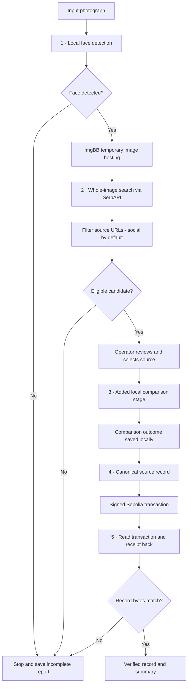
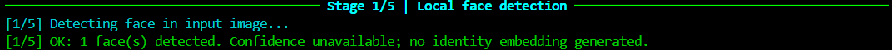
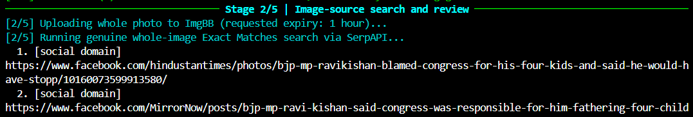
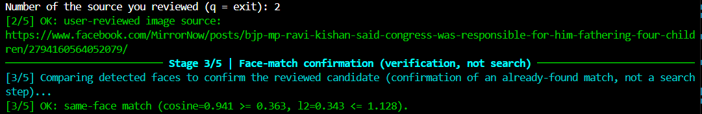
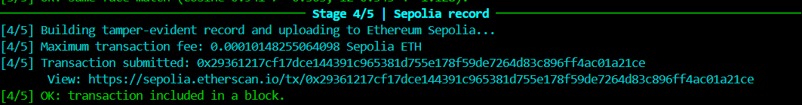
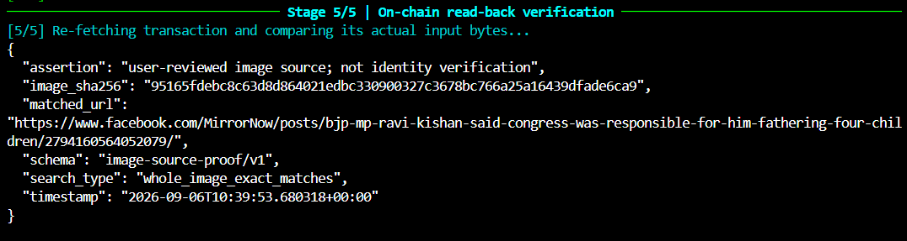
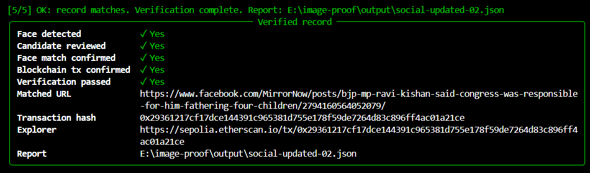
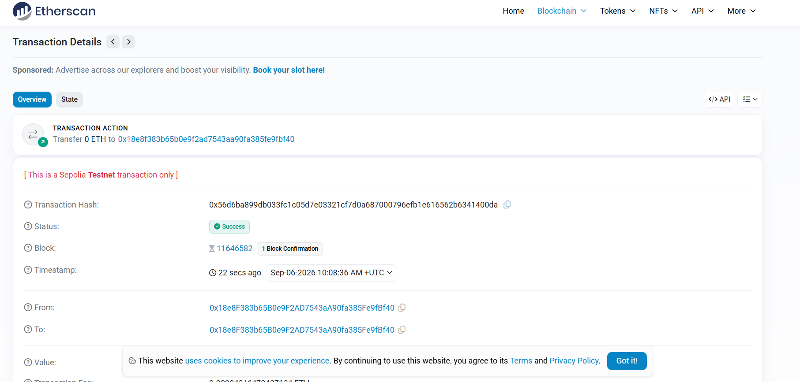
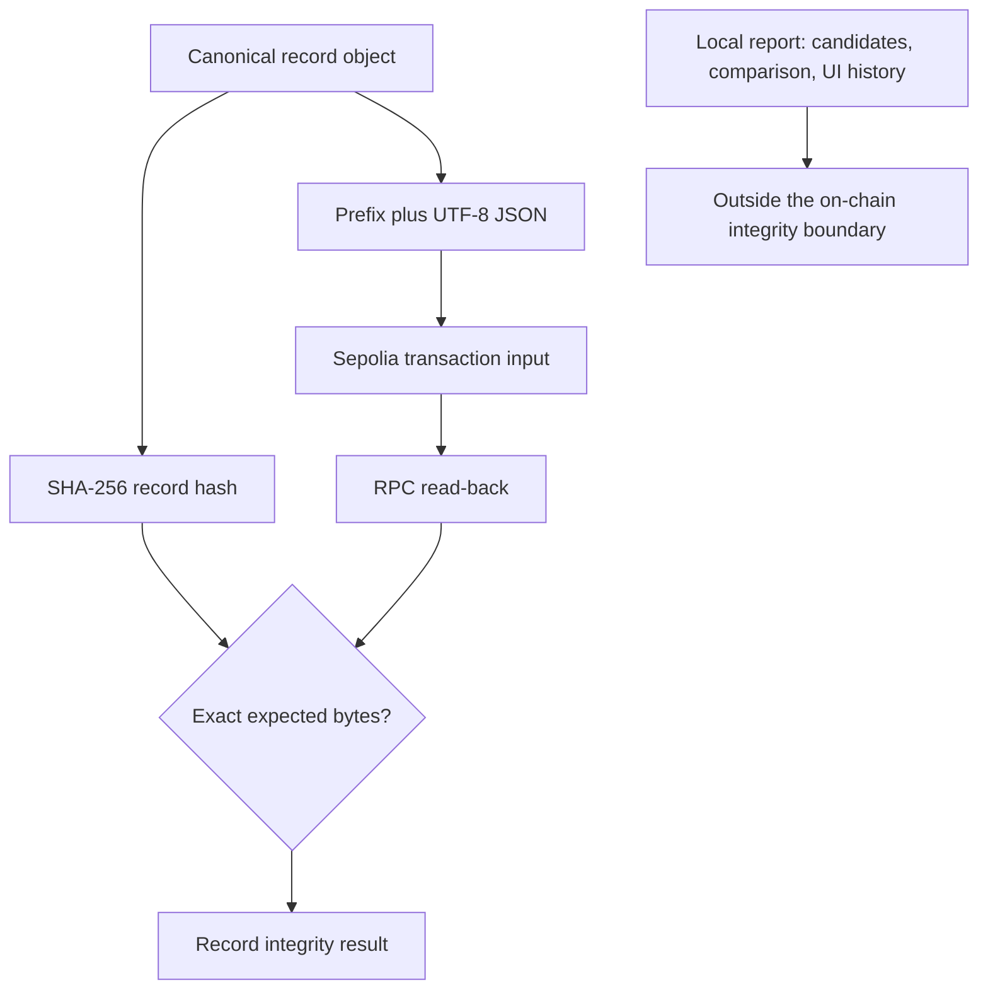

# Face ID + Blockchain Verification

### Whole-image search · Human review · Tamper-evident records

A Python CLI prototype for **Hackerhouse Goa — Task #3**, connecting image-source
search with a public Ethereum Sepolia record and independent transaction read-back.
Five numbered terminal stages expose the work as it happens, with source review
by the operator and a final evidence summary.

> **What “verified” means here:** the recorded JSON matches the bytes retrieved
> from a successful blockchain transaction. It does not mean that the person's
> identity, ownership of the post, or truth of the source has been established.

| Interface | Discovery | Default sources | Blockchain | Evidence |
|---|---|---|---|---|
| Python terminal CLI | Whole-image reverse search | Social domains | Ethereum Sepolia | JSON report + transaction read-back |

**Explore:** [Scope](#scope-decisions-and-why) · [Architecture](#architecture) ·
[Five stages](#the-five-stages) · [Screenshots](#terminal-walkthrough-and-screenshots) ·
[Data and proof](#what-is-recorded-and-what-is-proven) · [Limitations](#known-limitations)

## Scope decisions and why

This document describes the supplied five-stage `main.py`, including its added
comparison stage. It is an implementation overview and evidence guide, not an
operating guide for facial identification against web results.

- **Discovery uses the whole photograph.** ImgBB hosts the supplied image, and
  SerpAPI returns Google Lens Exact Matches results. Face embeddings are not sent
  to the search API and are not used to generate additional candidates.
- **The added comparison follows operator selection.** The supplied code uses
  OpenCV YuNet and SFace to compare the input with an image associated with the
  selected result. Its verdict is a model estimate, not independently established
  identity. Placing comparison after review does not turn it into proof that a
  social account belongs to the subject.
- **Social-domain filtering is the default.** A permitted domain can lead to a
  post, profile, channel, login screen, or unavailable page. A social-domain URL
  is not proof of a verified social post about the subject. Review remains required.
- **Comparison is advisory in this implementation.** A `different_or_uncertain`
  or handled `unable_to_verify` outcome does not block the blockchain write.
- **Blockchain evidence has a precise scope.** Only the canonical `record` object
  is written on-chain. Comparison scores and encoding hashes are local report
  fields and are not protected by the transaction's record hash.

The intended scope is a bounded image-source provenance demonstration, not a
general facial-identification or people-search service. There is no embedding
search index, bulk face-search interface, or profile-enrichment stage in the
supplied implementation. No claim of verified identity is made by this README.

## What changed in this version

| Addition | Actual behavior in the supplied code |
|---|---|
| Five-stage workflow | Adds a comparison stage between source review and blockchain recording. |
| Post-selection comparison | YuNet detects and aligns faces; SFace produces comparison features locally. |
| Expanded report | Saves comparison metrics, verdict, reason, and encoding hashes without raw vectors. |
| Model-file checks | Downloads model files when needed and checks them against SHA-256 constants in the code. |
| Social-first results | Filters candidates by allowed domains unless the web override is selected. |
| Rich presentation | Numbered rules, colors, live network spinners, and a boxed outcome summary. |
| Recovery checkpoints | Saves the expected transaction hash before broadcast and receipt information after inclusion. |
| Independent read-back | Re-fetches transaction input and receipt, then compares the on-chain bytes with the saved record. |

**Important distinction:** stage 1 uses a Haar cascade; stage 3 uses YuNet. These
are different detectors. This version also does not generally extract an image
from the reviewed page's HTML.

## Architecture



The diagram shows normal control flow. Cancellation, network errors, invalid
configuration, or unhandled image/model errors can interrupt a stage. Handled
comparison uncertainty continues to stage 4; it is not an acceptance gate.

### Components and boundaries

| Component | Responsibility | Data boundary |
|---|---|---|
| Local Python process | Detection, selection, comparison, hashing, signing, reporting | Reads input bytes and credentials locally. |
| ImgBB | Makes the entire photo accessible to the search provider | Receives the full image; expiry requested at one hour. |
| SerpAPI / Google Lens | Returns exact-image source candidates | Receives the hosted image URL. |
| Operator | Reviews and selects a candidate source | Selection is an assertion by the operator, not automated source authentication. |
| Candidate image host | Supplies a thumbnail or directly served image | Availability and image quality affect the comparison. |
| Model-file hosts | Supply model binaries for the added stage | The code checks downloaded bytes against its configured hashes. |
| Sepolia RPC | Accepts a signed transaction and returns chain data | Receives the signed transaction, not the wallet private key. |
| Sepolia explorer | Public inspection of transaction evidence | Provides an external view of the transaction. |

## The five stages

### 1. Local face detection

OpenCV decodes the input and applies its bundled frontal-face Haar cascade.
Detection rectangles are reported in descending area order. A missing face or
invalid image stops the run before upload.

- Input-size limit: **20 MiB**.
- Detector image size is reduced when its longest dimension exceeds 1,600 pixels.
- Multiple rectangles are retained; the largest is identified in the report.
- Detection confidence is **`null`**, because this detector does not provide a
  calibrated probability in the implementation.

The stage-1 message “no identity embedding generated” applies to that stage only.
It does not describe the entire five-stage version, which has a later comparison.

### 2. Whole-image search and operator review

The full image is uploaded to ImgBB with a requested 3,600-second expiry. SerpAPI
is called for Google Lens `exact_matches` with caching disabled in the request.
The program validates URLs, removes duplicates, filters domains, and displays
numbered candidates for review.

| Supported platform | Allowed domains |
|---|---|
| Instagram | `instagram.com` |
| Facebook | `facebook.com` |
| YouTube | `youtube.com`, `youtu.be` |
| X / Twitter | `x.com`, `twitter.com` |
| LinkedIn | `linkedin.com` |
| Reddit | `reddit.com` |

True subdomains are accepted; a lookalike such as `youtube.com.example.org` is
not an allowed YouTube domain. Filtering applies locally to returned candidate
links, not to Google's underlying index.

The API's Exact Matches label is not a byte-for-byte match verified by this code.
There is no pagination, visual-match fallback, or guarantee of at least one result.

### 3. Added local comparison

The supplied implementation includes YuNet face detection/alignment and SFace
feature comparison after the operator has selected a source. It records cosine
similarity and normalized L2 distance; both configured conditions must pass for
the code's `same_face` verdict. These quantities are not confidence percentages.

| Reported outcome | Meaning in this implementation | What follows |
|---|---|---|
| `same_face` | Both comparison conditions pass. | Outcome saved; source record proceeds. |
| `different_or_uncertain` | At least one condition does not pass. | Outcome saved; source record still proceeds. |
| `unable_to_verify` | A handled download, model-fetch, or missing-face condition prevents comparison. | Reason saved; source record still proceeds. |

The code attempts the API-provided **thumbnail first**. It then tries the reviewed
URL only if it directly serves an image. It does not parse a social page's HTML,
resolve an image gallery, or extract the post's original photograph.

Only the largest detected face in each image is used. A group photo is not
automatically rejected and may result in comparison of different people. Model
initialization or OpenCV processing errors outside the handled branches can still
stop the complete run.

### 4. Sepolia record

The program serializes the source record as canonical JSON, hashes that JSON,
and signs a **zero-value self transaction** containing the record in its input
data. No smart contract is deployed.

| Property | Implementation |
|---|---|
| Network | Ethereum Sepolia |
| Chain ID | `11155111`, checked against the RPC |
| Gas currency | Sepolia test ETH |
| Fee model | EIP-1559 fee fields and estimated gas with a margin |
| Recipient | The signing wallet's own address |
| Transaction value | Zero; gas is still required |
| Payload limit | 16 KB in this implementation |
| Receipt waiting | Up to 180 seconds, polling every 2 seconds |

The expected signed transaction hash is saved before broadcast. A successful
receipt is checkpointed separately. This makes an uncertain broadcast distinguishable
from a confirmed transaction, without automatically sending a replacement.

### 5. On-chain read-back

The verifier checks the local record hash, retrieves the transaction and receipt,
and compares actual transaction input with the expected prefixed JSON bytes.
It also checks successful inclusion, chain ID, sender, self recipient, zero
value, and agreement with the node's current canonical block.

The final report includes block information, confirmation count, and verification
time. One mined block is sufficient for the current success condition; this is
not a claim of finality.

## Terminal walkthrough and screenshots

**Evidence status: screenshots have not yet been added.** The slots below are
intentionally commented out so the README does not display broken images or
imply that a successful run has already been documented.

Place your actual screenshots in `docs/screenshots/`, use the exact names below,
and uncomment each image line after its file has been added. Keep captions faithful
to the observed outcome, including uncertain or failed stages.

### Step 1 — Face detection

Capture the stage header, input-processing message, and detected face count.
The caption should distinguish face detection from identity verification.



### Step 2 — Search results and source review

Capture the real search progress, returned social-domain candidates, and operator
selection. Domain membership alone is not evidence that a particular post is valid.

 

### Step 3 — Reported comparison outcome

Capture the actual stage-3 outcome, including `unable_to_verify` or uncertainty if
that is what occurred. Describe it as the model's reported outcome, not proof of
identity. A screenshot does not establish that the candidate was the original
image from the reviewed post.



### Step 4 — Transaction submission and inclusion

Capture the transaction hash, explorer URL, and receipt-success message. A
submitted hash without a successful receipt is not confirmed inclusion.



### Step 5 — Read-back verification

Capture the decoded on-chain record and byte-comparison result. This is the
evidence for record integrity, not for the comparison stage's accuracy.



### Final summary and independent explorer evidence

Capture all summary rows together. A green “Verified record” panel can coexist
with an unconfirmed face-comparison row; the two refer to different claims.






**Screenshot hygiene:** never show `.env`, private keys, API keys, seed phrases,
or authenticated RPC URLs. Use only images and evidence you are authorized to
publish. If the repository ignores `*.png`, add exceptions for this evidence folder
before committing your screenshots:

```gitignore
!docs/screenshots/
!docs/screenshots/*.png
```

Screenshots explain individual steps; they do not replace the hackathon's required
unedited end-to-end recording. No screenshot or successful transaction is supplied
or fabricated by this README.

## What is recorded and what is proven

### Record integrity boundary



| Data | Local report | Inside the on-chain record |
|---|---|---|
| Input image SHA-256 | Yes, under `record` | Yes |
| Selected source URL | Yes | Yes |
| Record timestamp, schema, search type, assertion | Yes | Yes |
| Face detection rectangles and count | Yes | No |
| Search candidates, thumbnails, API search ID and search scope | Yes | No |
| Comparison metrics, thresholds, verdict and reason | Yes | No |
| Input and candidate encoding hashes | When produced | No |
| Raw face vectors | Not serialized into the report | No |
| Input photograph or source-page body | Not embedded in the JSON report | No |
| Transaction hash, explorer link and receipt metadata | Yes | Transaction metadata, not fields in the payload |

The on-chain `record` has these fields:

`schema` · `image_sha256` · `matched_url` · `timestamp` · `search_type` · `assertion`

`record_hash` is SHA-256 over sorted-key, compact UTF-8 JSON. The transaction input
starts with `IMAGE_SOURCE_PROOF_V1` followed by a newline and that JSON.

The outer `face_match_verification` object contains `attempted`, `same_face_verdict`,
`reason`, the distance-metric fields, threshold fields, both encoding hashes, and
`candidate_image_source`. The entire report is **not** covered by `record_hash`.
An altered comparison result can therefore remain undetected by record read-back.

### Reading an existing record

The read-back-only mode accesses an existing transaction. It does not upload a new
image, discover candidates, run the comparison, or broadcast another transaction:

```powershell
.\.venv\Scripts\python.exe main.py --verify-report "output\report.json"
```

This mode needs the configured Sepolia RPC. Substitute the actual saved report
filename if a run used a custom output path. Earlier-stage summary rows are
saved-run history, not stages re-executed during this command.

The report itself is not an independent trust anchor: retain the transaction ID
separately when demonstrating that neither a record nor its reference was replaced.

## Technology and project files

| Technology | Role observed in the supplied implementation |
|---|---|
| Python | CLI orchestration, error handling and report generation |
| OpenCV + NumPy | Image decoding, local detection and added image comparison |
| Requests | Uploads, search requests and image/model retrieval |
| python-dotenv | Loads configuration beside `main.py`; existing environment variables take precedence |
| Rich | Terminal colors, stage rules, network status and result panels |
| web3.py | Transaction signing/broadcast and read-back checks |
| hashlib / JSON | SHA-256 and canonical serialization |

The earlier project targeted Python **3.11.9** and used pinned direct dependencies.
An updated `requirements.txt` was not attached for this documentation review, so
this README does not certify the installed versions or model compatibility of the
uploaded five-stage build. Model files are additional runtime assets, not Python
packages bundled into the submitted source.

| File or folder | Purpose |
|---|---|
| `main.py` | Five-stage application supplied for this review |
| `README.md` | Architecture, behavior, evidence and limitations |
| `requirements.txt` | Project dependency pins; verify against the submitted build |
| `.env.example` | Credential names without real secrets |
| `.env` | Local secrets; never publish |
| `models/` | Cached model assets used by the added comparison stage |
| `photos/` | Local input photographs; publish only with appropriate permission |
| `output/` | Run reports and recovery state |
| `docs/screenshots/` | Selected terminal and explorer evidence |

Configuration names present in the code are `SERPAPI_API_KEY`, `IMGBB_API_KEY`,
`SEPOLIA_RPC_URL`, and `WALLET_PRIVATE_KEY`. These must not be included in screenshots
or repository history. A faucet uses a public wallet address, never the private key.

## Terminal behavior

- Five numbered cyan stage dividers show the current phase.
- Existing `OK:` messages are green; top-level errors are red.
- Network status spinners are scoped to real calls and receipt polling, with no
  artificial percentage or presentation delay.
- Operator prompts and local processing are not represented as network progress.
- The final panel distinguishes detection, review, comparison, transaction
  confirmation, and record verification.
- Read-back mode labels prior detection, review, and comparison as saved-run history.
- URLs and provider-derived text are rendered literally rather than as Rich markup.
- Non-terminal output does not animate spinners. Color support depends on the
  terminal; explicit text remains alongside status symbols.

## Known limitations

### Search and social sources

- A public post may not be indexed. Private, deleted, login-only or recently posted
  material may yield no results. Temporary hosting does not itself create a match.
- Social filtering covers candidate page URLs, not every URL in the report:
  thumbnails can use provider/CDN domains and the explorer is a blockchain URL.
- Exact Matches is a provider category. The code does not independently verify
  that the source image is byte-identical to the uploaded file.

### Added comparison stage

- The first detector and comparison detector differ; their detections can disagree.
- Thumbnails may be low resolution, altered, or unrelated to the intended subject.
  The code does not establish original-image provenance from the page HTML.
- Largest-face selection can choose the wrong person in a group photograph.
- Similarity values are not probabilities, and fixed thresholds are not a
  validation study for these inputs or deployment conditions.
- `candidate_image_source` is inferred from whether a thumbnail field exists. If
  that download fails and the direct-image fallback succeeds, the label can still
  say `thumbnail`. It is not a reliable download audit trail.
- Some failures return `unable_to_verify`; unexpected OpenCV/model-loading errors
  can still stop the run. “Always continues gracefully” would overstate coverage.
- Encoding hashes are not proof of identity, anonymization, or consent. The code
  does not store raw vectors in JSON, but processes them in local memory.

### Blockchain and reporting

- A transaction records a claim; it does not independently validate the selected
  URL or the comparison outcome.
- Comparison results are outside the on-chain payload and are not re-evaluated by
  the read-back command. A verified record may accompany an uncertain comparison.
- Gas estimation happens before the explicit balance check; an unfunded wallet
  can produce an RPC allowance error instead of the custom insufficient-funds message.
- Receipt inclusion is not finality. Reorganizations, RPC outages, explorer lag,
  testnet changes and faucet eligibility can affect a demonstration.
- The report timestamp comes from the local clock; the block timestamp is separate.
- SHA-256 identifies exact file bytes. Metadata edits or recompression change the hash.
- Concurrent use of one wallet can produce nonce conflicts. The code preserves
  transaction references but does not implement concurrent transaction management.

## Privacy and ethical use

The intended use constraint is consenting subjects and authorized source material.
Using images to identify or locate non-consenting individuals raises serious
privacy and stalking concerns and is not condoned. Consent and authority to publish
evidence must be established separately; the program does not validate them.

The original photo leaves the machine during upload and may contain EXIF metadata.
ImgBB expiry is requested, not independently audited, and does not guarantee deletion
from other providers' logs, caches or backups. Selected URLs and image hashes placed
on a public testnet should be treated as persistent disclosures.

Model outcomes must not be presented as proof that someone owns a social account,
appears in a verified post, or has consented. Keep secrets and unnecessary personal
data out of the repository, reports shared with others, screenshots and recording.

## Validation and submission evidence

This README was checked against the uploaded `main.py` by source inspection.
**The five-stage build was not executed or independently validated in this review.**
Test results for an earlier four-stage build do not establish that this added
comparison implementation works end to end.

| Evidence | Status for this documentation delivery |
|---|---|
| Source behavior and report structure | Reviewed statically |
| Terminal screenshots | To be supplied by the project author |
| Successful Sepolia transaction and read-back | Not supplied as independently checked evidence |
| Added comparison accuracy or model compatibility | Not validated |
| Unedited end-to-end recording | To be attached by the project author |

For a clear submission, keep the repository code, dependency pins, README and
recorded terminal stages consistent. Attach genuine stage screenshots, the actual
transaction reference and an unedited recording. Record failures and uncertainty
honestly; do not replace them with staged success output.

---

**The deliverable is an inspectable record of what was selected and stored—not a
blockchain proof of a person's identity.**
